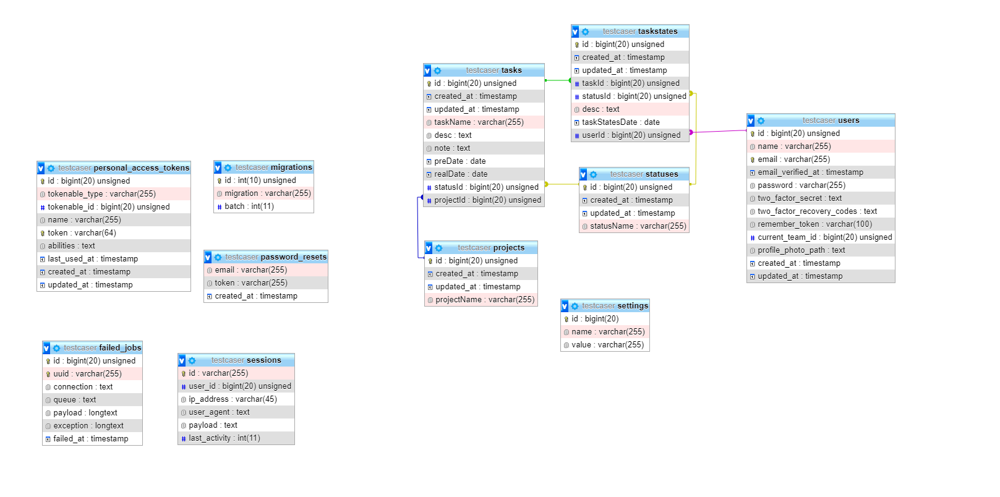

<h1>TESTCASER</h1>

<h2>Emircan ÇETİN</h2>

Celal Bayar Üniversitesi Yazılım Mühendisliği

<h3>Yazılım Sınama Dersi Proje Ödevi</h3>

<h4>Kurulum</h4>
<ol>
<li>Öncelikle apache ve mysql server gereklidir.</li>
<li>testCaser adında bir veritabanı oluşturun.</li>
<li>.env klasöründe veritabanı ayarlarınızı doğrulayın.</li>
<li>Proje dosyalarını apache serverda testCaser adında bir klasöre kopyalayın.</li>
<li>testCaser kalösürde comut istemi çalıştırın (composer kurulu olmalıdır.)</li>
<li><code>php artisan migrate</code> komutunu çalıştırın</li>
<li>Projenin ana yolu şudur :"localhost/testCaser/public". Ancak virtualhost oluşturarak kolaylık sağlayabilirsiniz.</li>
</ol>

<h4>Test</h4>
<ol>
<li>Whitebox testler <code>tests/browsers</code> klasörü içindedir</li>
<li>Testleri koşturmak için <code>php artisan dusk</code> komutunu çalıştırın. Başarılı testler ".", hatalı testler "E" ve başarısız testler "F" ile belirtilmektedir.</li>
</ol>

<h4>Kullanılan Teknoloji ve Paketler</h4>
<ul>
<li>Laravel v.8</li>
<li>Laravel Ui</li>
<li>Jetstream</li>
<li>Liveware</li>
<li>Fortify</li>
<li>Blade</li>
<li>Bootstrap</li>
<li>Jquery</li>
<li>Lbc</li>
<li>Carbon</li>
</ul>

## License

The Laravel framework is open-sourced software licensed under the [MIT license](https://opensource.org/licenses/MIT).
